# Test Step
## Environment
    - SQL Server (DB)
    - DBeaver (Editor, Connector)
## 1. Create Database Northwind

```
create database Northwind;
```
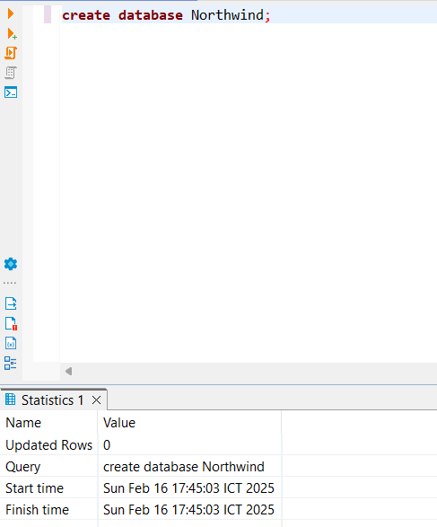

## 2. Create procedure create table
REF : https://en.wikiversity.org/wiki/Database_Examples/Northwind/SQL_Server <br>
<h3>Run procedure script create table </h3>

    1. ทำการ copy query จาก P_CREATE_TABLE.sql แล้วทำการ Run เพื่อสร้าง Procedure

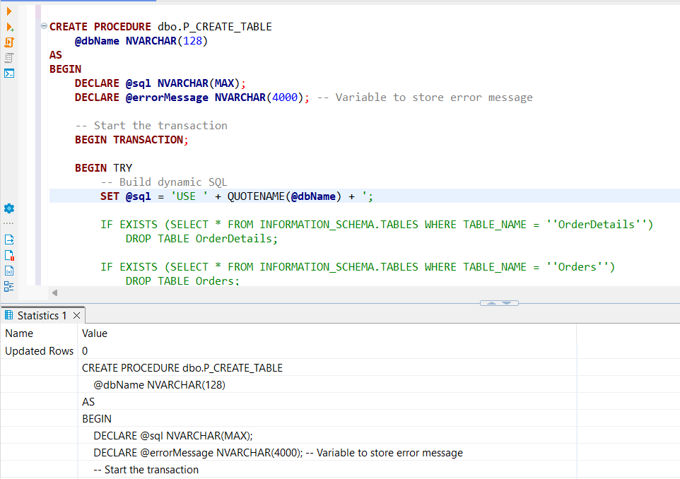


    2. ทำการตรวจสอบใน Folder Procedure ว่ามี P_CREATE_TABLE ที่สร้างไว้ไหม

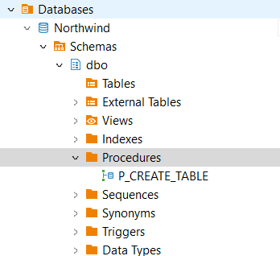

## 3. Create procedure insert data
<h3>Run procedure script insert data </h3>

    1. ทำการ copy query จาก P_INSERT_DATA.sql แล้วทำการ Run เพื่อสร้าง Procedure 

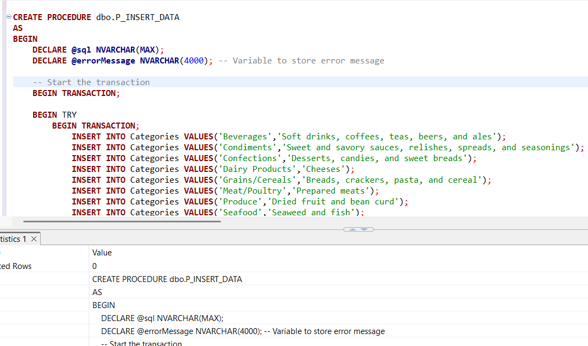


    2. ทำการตรวจสอบใน Folder Procedure ว่ามี P_INSERT_DATA ที่สร้างไว้ไหม

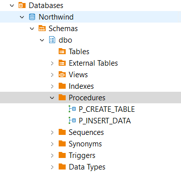

## 4. Run procedure create table & insert data

ทำการ Execute Procudure P_CREATE_TABLE เพื่อทำการ check ว่ามีตารางไหมและสร้างตารางขึ้นมา โดยรับ parameter คือชื่อ DB

```
EXEC P_CREATE_TABLE Northwind;
```

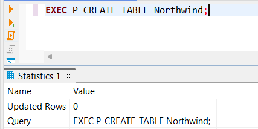

ตรวจสอบว่า table ถูกสร้างเรียบร้อยหรือยัง

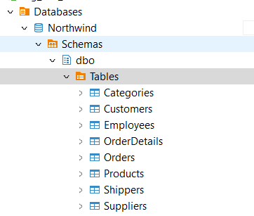

ทำการ Execeute Procedure : P_INSERT_DATA เพื่อทำการ insert ข้อมูลเข้าตาราง

```
EXEC P_INSERT_DATA;
```

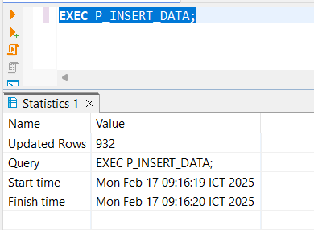

ตรวจสอบว่ามีข้อมูลหรือยังด้วยการ select ข้อมูลขึ้นมาดู

```
select top(10) * from Northwind.dbo.Categories;
```
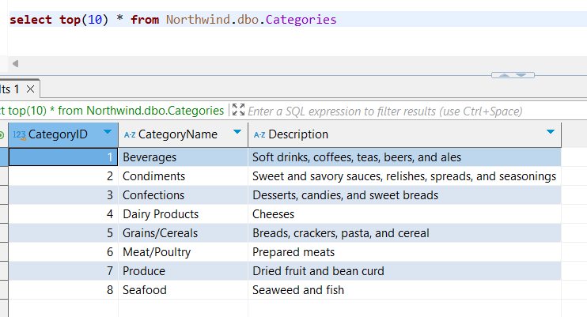

## 5. ทำการทำแบบทดสอบข้อที่ 1

<h3> โจทย์</h3>
<h4> Find the customer with the highest total spending in each country, considering only orders with more than 10 items and a total order value greater than $1,000. </h4>

<h3> คำตอบ อยู่ใน file ชื่อ TEST1_.sql</h3>
ใน query นีใช้ CTE ในการสรุปข้อมูลขึ้นมาก่อน 1 ชั้น ทำการ join กันทั้งหมด 4 ตารางได้แก่ Orders [เชื่อมข้อมูลสินค้ากับลูกค้า], OrderDetails [ปริมาณการขาย], Customer [ชื่อลูกค้า, ประเทศ], Products [ราคาสินค้า] และมีเงื่อนไขว่า ต้องมีจำนวนสิ้นค้ามากกว่า 10 ชื้น และมีมูลค่ารวมของรายการสั่งซื้อนั้น > 1000 
<br><br>
CTE :

* **CustomerSpen** ทำการหา order ที่มีสินค้า > 10 ชิ้น และมียอดรวมใน order นั้น > 1000
* **GroupCountry** ทำการ Group spending การใช้จ่ายของลูกค้า
* **TopSpending** ใช้ window fn ทำการลำดับ customer แต่ละประเทศ ที่มีการใช้จ่ายจากมากไปน้อย
* **select** ทำการเลือกข้อมูล CustomerID, CustomerName, Country, Spending, TopSpend โดยมีเงื่อนไขว่าเป็น รายการที่มีค่าใช้จ่ายเป็นอันดับ 1


```
with CustomerSpen as 
	(
	select OrderID, CustomerID, CustomerName, Country, sum(Spending) as Spending
	from (select o.OrderID, c.CustomerID, c.CustomerName, c.Country, od.Quantity, p.Price, (od.Quantity * p.Price) as Spending 
	from (select OrderID, CustomerID from Orders) o 
	join (select OrderID, ProductID, Quantity from OrderDetails) od on o.OrderID = od.OrderID 
	join (select CustomerID, CustomerName, Country from Customers) c on o.CustomerID = c.CustomerID 
	join (select ProductID, Price from Products) p on od.ProductID = p.ProductID 
	where od.Quantity > 10) b
	group by OrderID, CustomerID, CustomerName, Country
	having sum(Spending) > 1000
    ),
GroupCountry as
 (select CustomerID, CustomerName, Country, sum(Spending) as Spending from CustomerSpen group by CustomerID, CustomerName, Country),
TopSpending as 
	(select *, row_number() over(partition by Country order by Spending desc) as TopSpend from GroupCountry)
select CustomerID, CustomerName, Country, Spending 
from TopSpending 
where TopSpend = 1 
order by Spending desc;

```

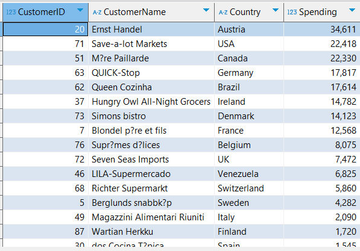


## 6. ทำการทำแบบทดสอบข้อที่ 2

<h3> โจทย์</h3>
<h4> Create a stored procedure that takes a year as a parameter and displays a summary report of sales by category in each quarter of that year, presented in a pivot table format </h4>

<h3> คำตอบ อยู่ใน file ชื่อ TEST2_.sql </h3>
วิเคราะห์โจทย์ข้อนี้กันก่อน

* ให้สร้างเป็น Procedure แล้วแสดงผลลัพธ์
* รับ parameter คือ ปี
* ทำ summary report ตาม quater ปีที่ได้รับมา
* สรุปผลออกเป็น PIVOT Table

ซึ่งก็มีการ join กัน 4 ตารางเพื่อนำข้อมูลมาวิเคราะห์ เพื่อเอา Year , Quater, CategoryName, ยอดรวม โดยมีเงื่อนไขกรองเฉพาะ ปี ที่ได้รับมาจาก @Year จากนั้นทำการ PIVOT table โดยนำเอา Quater ขึ้นไปกางออกเพื่อที่จะดูยอดกลุ่มสินค้าในแต่ quater

```
CREATE PROCEDURE dbo.reportSalesQByCategory
	-- create parameter @Year
	@Year NVARCHAR(4)
AS
BEGIN
	-- create variable @sql
	DECLARE @sql NVARCHAR(MAX);

	-- Start transaction
	BEGIN TRANSACTION;
		-- Start Try
		BEGIN TRY
			-- Set query to @sql
			SET @sql = '
				SELECT CategoryName, OrderY,[1] AS Q1, [2] AS Q2, [3] AS Q3, [4] AS Q4
                FROM (
                    SELECT 
                        DATEPART(YEAR, o.OrderDate) AS OrderY, 
                        DATEPART(QUARTER, o.OrderDate) AS OrderQ, 
                        c.CategoryName, 
                        (od.Quantity * p.Price) AS Spending 
                    FROM (select OrderID, OrderDate from Orders) o
                    LEFT JOIN (select OrderID, Quantity, ProductID from OrderDetails) od ON o.OrderID = od.OrderID
                    LEFT JOIN (select ProductID, Price, CategoryID  from Products) p ON od.ProductID = p.ProductID
                    LEFT JOIN (select CategoryID, CategoryName from Categories) c ON p.CategoryID = c.CategoryID
                    WHERE YEAR(o.OrderDate) = '+ QUOTENAME(@Year, '''') +'
				) AS SourceTable
				PIVOT (
				    SUM(Spending)
				    FOR OrderQ IN ([1], [2], [3], [4])
				) AS pvt;'
			
			-- execute sql
			EXEC sp_executesql @sql;
			-- Commit Transaction
			COMMIT TRANSACTION;
			PRINT 'Transaction Committed Successfully';
		END TRY
		-- Start CATCH
		BEGIN CATCH
			-- Rollback the transaction
        	ROLLBACK TRANSACTION;
        	PRINT 'Transaction Committed Error';
		END CATCH
END

```

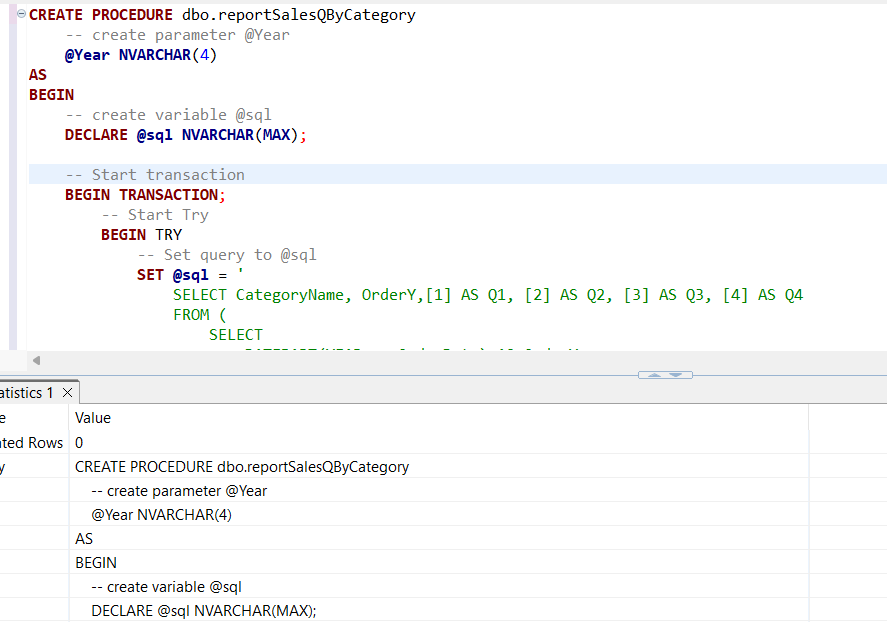

ทำการ Run EXEC เพื่อทดสอบ

```
EXEC dbo.reportSalesQByCategory 1996
```

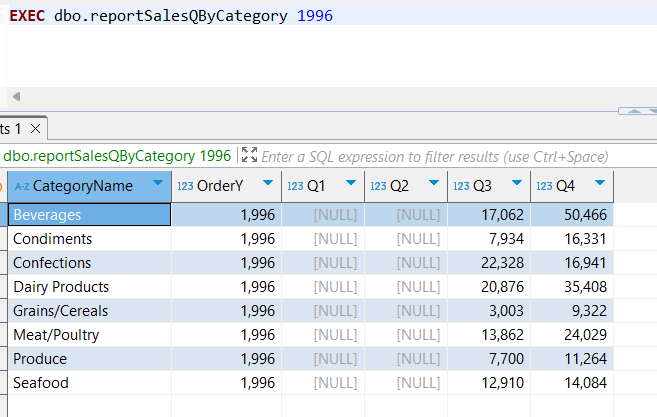

## 7. ทำการทำแบบทดสอบข้อที่ 3
<h3> โจทย์</h3>
<h4> Calculate the product with the highest sales increase compared to the previous quarter, displaying the result as a percentage increase. </h4>

<h3> คำตอบ อยู่ใน file ชื่อ TEST3_.sql </h3>
วิเคราะห์โจทย์ข้อนี้กันก่อน

* หาผลต่างระหว่าง quater เป็น %
* และต้องเป็นสินค้าที่ ยอดผลต่างสูงที่สุด

เริ่มต้นด้วยการใช้ CTE ทำ temp ข้อมูลก่อน

* **ProductSales** ทำการ group by รายปี, quater, productName แล้วทำการ sum ยอดขายขึ่นมา
* **PercentSales** เอาข้อมูลที่ได้จาก **ProductSales** ไปทำการ look up ข้อมูล โดยใช้ function LAG ยอดขาย ที่เรียงตาม order หากไม่มียอด = 0 เป็น subquery จากนั้น เรียงข้อมูลใหม่และเพิ่ม column PercentSales โดยมีเงื่อนไขหาก ยอดก่อนหน้า = 0 ให้เป็น Null แต่ถ้าไม่ใช่ก็เข้าสูตรในการหา ผลต่าง * 100 ให้กลายเป็น % 
* **Select** จากนั้นนำผลลัพธ์จาก **PercentSales** มาจัดอันดับแล้วเลือกแค่ อันดับ 1 ที่มี percent มากที่สุดซึ่งจะแสดงให้เห็นว่า ในปีนั้น มีquater ไหน สินค้าอะไร ที่มียอดเติมโตจาก quater ที่แล้วมากที่สุดกี่ %

```
with ProductSales as (
	SELECT 
	    YEAR(o.OrderDate) AS OrderY, 
	    concat('Q-',DATEPART(QUARTER, o.OrderDate)) AS OrderQ, 
	    p.ProductName, 
	    sum(od.Quantity * p.Price) AS Sales 
	FROM Orders o
	LEFT JOIN OrderDetails od ON o.OrderID = od.OrderID
	LEFT JOIN Products p ON od.ProductID = p.ProductID
	LEFT JOIN Categories c ON p.CategoryID = c.CategoryID
	group by YEAR(o.OrderDate), DATEPART(QUARTER, o.OrderDate), p.ProductName
)
,PercentSales as (
	select  *, 
		case
			when PrevSales = 0 then Null
			else ROUND((((Sales - PrevSales)/ Sales) * 100), 2)
		end as PercentSalse  from (
			select *, COALESCE(LAG(Sales) OVER(PARTITION BY ProductName ORDER BY OrderY,OrderQ),0) as PrevSales from ProductSales
	) b
)
select OrderY, OrderQ, ProductName, Sales, PrevSales, PercentSalse from (
	select *, RANK() OVER(partition by OrderY order by PercentSalse desc) as ranks_1 from PercentSales
) b 
where ranks_1 = 1
```

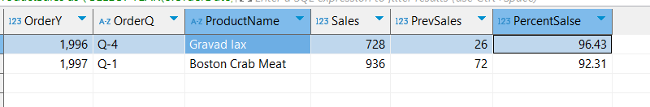
